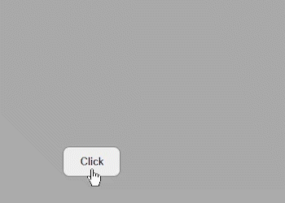

# Tiny Popup Menu
<p align="center">
    <a href="https://www.npmjs.com/package/tiny-popup-menu">
        
    </a>
    <a href="https://img.shields.io/npm/dm/tiny-popup-menu">
        
    </a>
    <a href="https://github.com/gastonzalba/tiny-popup-menu/blob/master/LICENSE">
        
    </a>
</p>

Tiny vanilla javascript library to display popup menus next to button togglers.

The popup menu uses a fixed position calculated by javascript, allowing the toggler to be inside of scrollables elements, auto adjust margins, evaluate the position (to be on top or at the bottom of the toggler), etc.

If you want only one menu open at a time, use a unique instance. But if you want multiples menus opened at the same time, instead create multiples instances.



## Example
See an online example/playground [here](https://raw.githack.com/GastonZalba/tiny-popup-menu/v1.0.5/examples/basic.html).

## Usage
### Creating an instance

```js
var tinyPopupMenu = new TinyPopupMenu({
    /**
     * Close menu after selecting an item
     * Defaults is true;
     */
    autoclose: true,

    /**
     * Show the menu at top or at bottom of the toggler
     * Default is 'bottom'
     */
    position: TinyPopupMenu.Position.Bottom,

    /**
     * Margin between the menu and the toggler button.
     * Default is 10 if `arrow` is true, otherwise is 5
     */
    margin: 5,
    
    /**
     * Offset to display the menu
     */
    offset: {
        x: 0,
        y: 0
    },

    /**
     * Custom classname to add to the popup menu
     */
    className: '',

    /**
     * Show css arrow
     * Default is `true`
     */
    arrow: true,

    /**
     * Prevent event propagation
     * Default is `true`
     */
    stopClick: true,

    /**
     * Menu items to display in the menu
     */
    menuItems: [
        {
            content: 'Display alert 😎',
            callback: () => alert('Alert')
        },
        {
            content: 'Display another alert',
            callback: () => alert('Another alert')
        },
        '-', // separator
        {
            content: 'Delete',
            callback: () => alert('Delete!'),
            className: 'delete'
        }
    ]
});

// You can add the `onclick` or `oncontextmenu` listeners to each button and trigger the `open` method to it
myTogglerButton.onclick = function (event) {
    tinyPopupMenu.open(event);
};

// or add the button programatically to the instance
tinyPopupMenu.addToggler(myTogglerButton, {...customOptions}, 'click');
```

### Events
```js
tinyPopupMenu.on('open', () => console.log('Open event'));
tinyPopupMenu.on('close', () => console.log('Close event'));
tinyPopupMenu.on('updateposition', () => console.log('Update position event'));
```


## Install

### Browser

#### JS

Load `tiny-popup-menu.js`. Tiny Popup Menu is available as `TinyPopupMenu`.

```HTML
<script src="https://unpkg.com/tiny-popup-menu@1.0.5"></script>
```

#### CSS

```HTML
<link rel="stylesheet" href="https://unpkg.com/tiny-popup-menu@1.0.5/dist/css/tiny-popup-menu.min.css" />
```

### Parcel, Webpack, etc.

NPM package: [tiny-popup-menu](https://www.npmjs.com/package/tiny-popup-menu).

Install the package via `npm`

    npm install tiny-popup-menu

#### JS

```js
import TinyPopupMenu from 'tiny-popup-menu';
```

#### CSS

```js
import 'tiny-popup-menu/lib/style/css/tiny-popup-menu.min.css';
// or scss
import 'tiny-popup-menu/lib/style/scss/tiny-popup-menu.scss';
```

##### TypeScript type definition

TypeScript types are shipped with the project in the dist directory and should be automatically used in a TypeScript project. Interfaces are provided for the Options.


## TODO
- Add `left` and `right` positions
- Add hoverable option
- Improve README
- Add hoverable submenu
- Themes

## License

MIT (c) Gastón Zalba.
